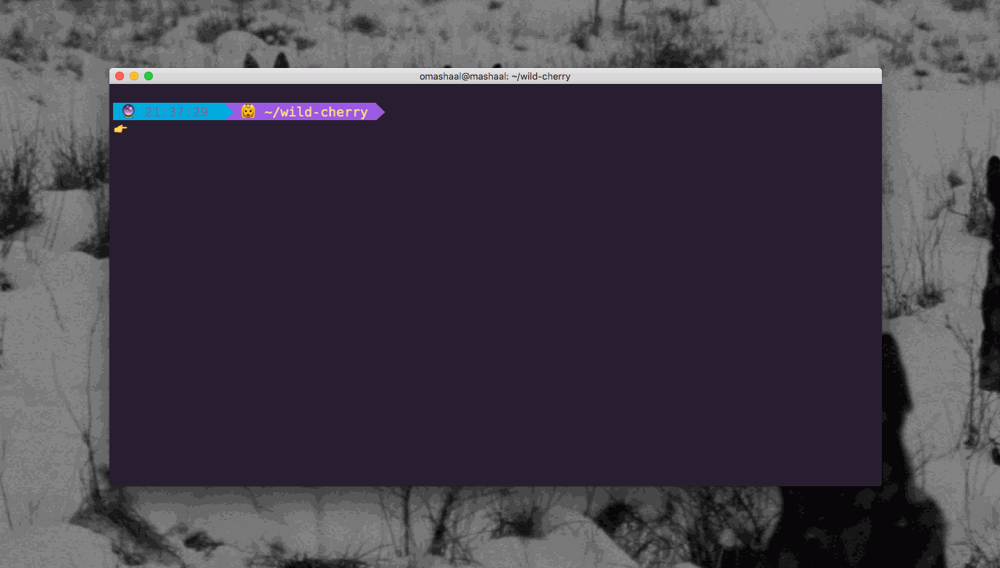
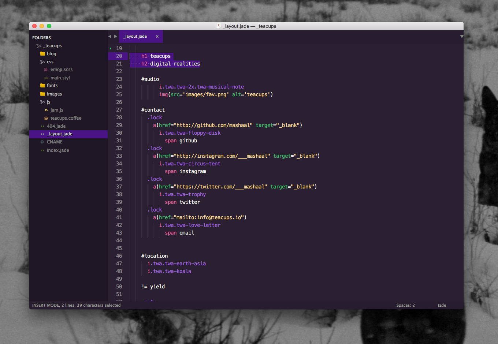

#Wild Cherry

> A fairy-tale inspired theme for [Zsh](http://www.zsh.org/), [iTerm](http://www.iterm2.com/), & [Sublime](http://www.sublimetext.com).


> :skull: Git Princess is close to death.

> :tulip: Commit to her and give her a flower.
 
> :japanese_ogre: Japanese Ogre appears on error. 



 

##Zsh

* This is a customized version of [agnoster](https://gist.github.com/3712874) and [remy](https://remysharp.com/2013/07/25/my-terminal-setup).
* In order for this theme to render correctly, you will need a [Powerline-patched font](https://gist.github.com/1595572).

**Activating...**

1. Move `zsh/wild-cherry.zsh-theme` file to [oh-my-zsh](https://github.com/robbyrussell/oh-my-zsh/)'s theme folder: `oh-my-zsh/themes/wild-cherry`.
2. Go to your `~/.zshrc` file and set `ZSH_THEME="wild-cherry"`. Finally, reload your terminal.


##iTerm

**Activating...**

1. *iTerm2 → `Preferences` → `Profiles` → `Colors` Tab*
2. Click *`Load Presets...`*
3. Click *`Import...`*
4. Select the `iterm/wild-cherry.itermcolors` file
5. Select the *`wild cherry`* from *`Load Presets...`*


##Sublime



* This is a customized version of the [Cobalt2](https://github.com/wesbos/cobalt2) UI.
* Massive thanks to [ctf0](https://github.com/ctf0) for his help! :tophat:

**Package Control**

1. Open package control `tools` → `Command Palette` and type `Install Package`
2. Search for `Wild Cherry` and hit enter
3. Lastly, open `Preferences` → `Settings - User`. Add the following two lines:

```
"theme": "wild-cherry.sublime-theme",
"color_scheme": "Packages//Wild Cherry/wild-cherry.tmTheme"
```
`color_scheme` defines how the code looks and `theme` defines how the sidebar, tabs, search, command palette work. 


